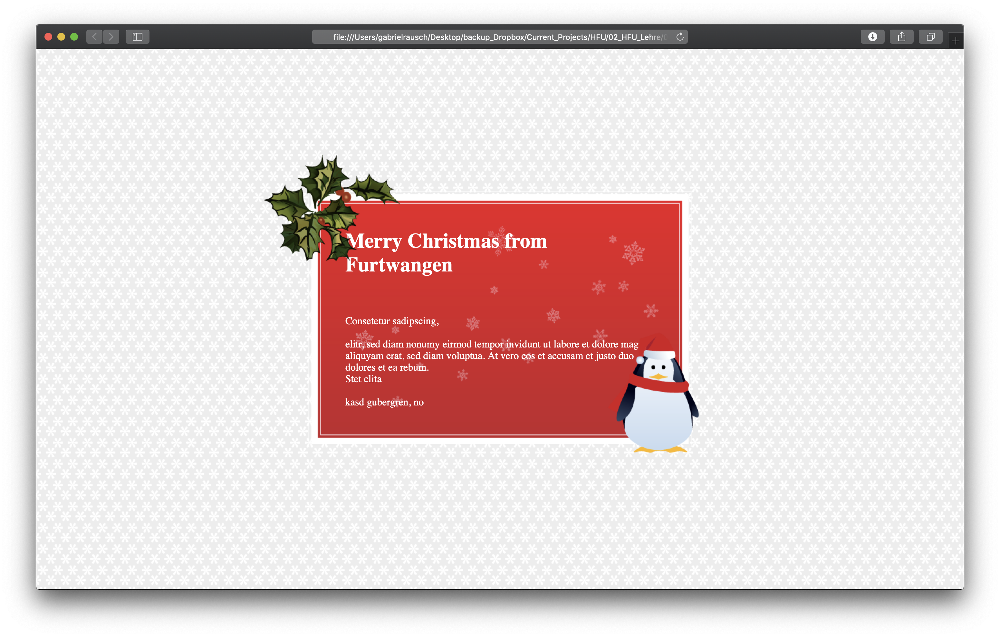

# Station "Positionierung"

Die Gestaltungsfragmente (in Ordner images) sollen wie in der Designvorlage abgebildet positioniert und arrangiert werden.

Zunächst einmal ist es sinnvoll einen Hauptcontainer für die Card zu erstellen, dieser muss horizontal und vertikal mittig platziert werden (dafür gibt es verschiedene Strategien in CSS).

Im nächsten Schritt müssen die Elemente "plant" und "penguin" platziert werden.
Dafür gibt es auch wieder verschiedene Möglichkeiten, hier eine Variante:

Den Img-Tags verschiedene CSS-Klassen vergeben und über CSS die Bilder absolut positionieren.
1. In CSS mit Klassen-Selektoren die Regeln setzten (.klassenname)
2. Eigenschaft „position“ mit dem Wert „absolute“
3. Der Wert „absolute“ richtet sich nach dem übergeordneten Objekt (hier also der Wrapper).
4. 0/0 Koordinate vom Wrapper ist also der Nullpunkt für das absolut positionierte Img-Element.
5. Eigenschaften „left“, „top“ oder auch „right“ und „bottom“ mit Pixelangaben als Werte z.B. 10px
6. Bild über den Wrapper hinaus positionieren: dabei müssen negative Pixelwerte gesetzt werden. Also bspw. um das Objekt tiefer als die untere Kante zu platzieren schreibt man bottom: -17px; Weiter nach rechts als die rechte Kante dann bspw: right: -23px;
7. Textelemente setzten (p, h1 usw...) und mit CSS gestalten (Textfarbe, Schriftart usw.)