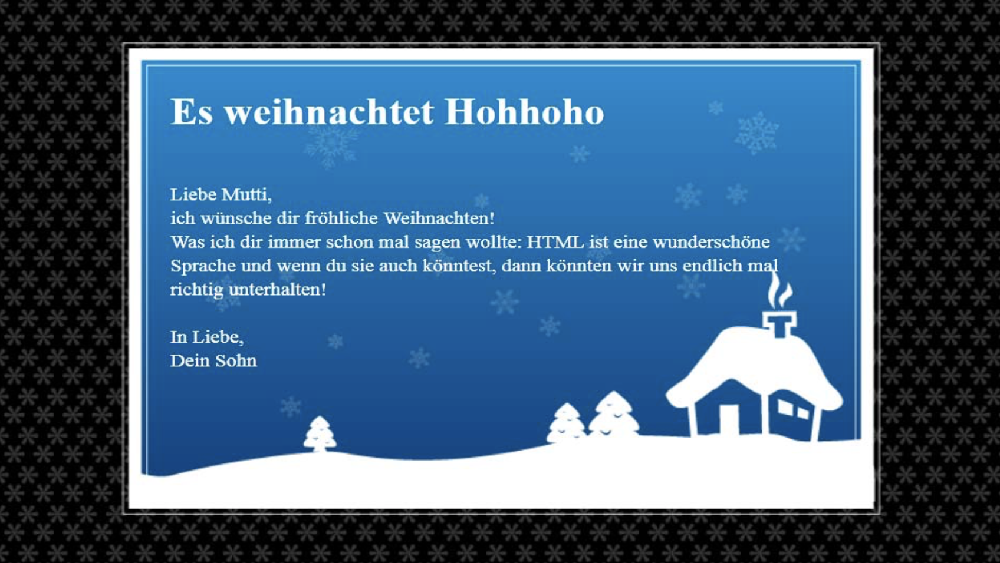

# Station "Background-Images und Muster"

Diese Aufgabe klingt erst einmal einfach: die Karte soll wie in der Designvorlage umgesetzt werden (in der Gestaltung und Positionierung).
Die Herausvorderung ist hier, die Grafikelemente selbst zu erstellen. Als Vorlage dienen Ihnen hier die Adobe-Illustrator Dateien. Dafür müssen Sie natürlich die Adobe Produkte installiert haben. Ansonsten können Sie auch ähnliche Gestaltungselemente in alternativen Programmen (Sketch, InkScape, Gimp...) erstellen - das wird Sie aber etwas mehr Zeit kosten.

Hier eine kurze Anleitung, für ein mögliches Vorgehen:

1. Zunächst einmal die Grundhtml-Struktur + Wrapper erstellen.
2. In der Interface-Datei stecken die Vorlagen für alle Grafiken. Die Grafikelemente können noch angepasst und verändert werden.
3. Der Musterhintergrund für den Body:
   Der Hintergrund ist im Illustrationsentwurf nur beispielhaft gesetzt (geht nicht über die ganze Fläche). Für die Website muss jetzt mit dem Slicewerkzeug ein Stück aus der Hintergrund-Illustration geschnitten werden (Slicebereich festlegen und als PNG über „für Web und Geräte speichern“ abspeichern). Dabei die Schwierigkeit: das Teilstück muss als Muster funktionieren (der ausgewählte Bereich wird als Hintergrund aneinander gekachelt, die Übergänge müssen also stimmen). Probieren SIe ein bisschen und setzten Sie im nächsten Schritt einen Muster-Versuch gleich als Hintergrund-Bild in die HTML-Datei, dann können Sie das Ergebnis bewerten, ob Ihre Mustergrafik korrekt vorbereitet wurde.
4. Bildelemente kommen üblicherweise in den Ordner „images“. Das Hintergrundbild kann jetzt mit der CSS-Eigenschaft „background-images“ eingefügt werden. Unter Umständen muss die Sliceauswähl in Illustrator noch einmal korrigiert werden, um eine ordentliche Mustergrafik zu erhalten.
5. Die Hintergrundgrafik für den Wrapper bzw. den Inhalt wird auch mit Hilfe des Slice-Werkzeugs aus dem Interfacelayout geschnitten (dabei beachten: Wrappergröße ist 600px X 400px, eine größere Grafik wird also abgeschnitten. Der Slice für die Hintergrundgrafik vom Wrapper kann also genauso groß sein wie der Wrapper selber). Auch hier wieder mit „background-image“ das Bild in den Hintergrund vom Wrapper legen. Außerdem: background-repeat: no-repeat, dann wird der Hintergrund nicht gekachelt (wie beim Body).
6. Setzen Sie etwas Inhalt/Text in den Wrapper und passe die Elemente in CSS an. Stellen Sie CSS-Regeln für Farbe, Schriftart usw. auf.
7. Mit einem Innenabstand für den Wrapper (padding) können die Textelemente nach innen verschoben werden.